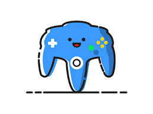

## My Personal Background
As a young child, I developed a deep interest in technology by secretly using my brother’s Nintendo 64 and fiddling around on his computer. I found it fascinating that I can independently play games in the comfort of my own room. At that time, it felt like an interactive TV show that I got to control, determining how the story would unfold. I enjoyed playing so much that my siblings further fueled my interest by letting me try every single game they could afford at the time. It ranged from old-school classics to new-gen, and from then on, I knew I wanted to be a part of creating the games I loved dearly.

## Introduction to Coding!
In high school, I took my first coding class, where we learned how to create a basic website using HTML. I remember the excitement I felt writing the code for "Hello World" and knew I wanted to keep exploring this field. The class also had us work on “Scratch”, which was a kid-friendly way to learn code. I struggled, but I admired the unique challenges I was facing. By the end of the class, it taught me how to problem-solve efficiently, and I was able to take those concepts and apply them to the world around me. I believe software engineering and web development paves the way for an "out of this world" future that will become a reality. This field is always changing, and hence, there is never a dull moment, which is why I look forward to pursuing and expanding my knowledge further.

## My Final Thoughts
Despite the actual coding part and learning about the rules and implementing them, I hope to develop soft skills. Soft skills, including communication, creative thinking, and time management, are, in my opinion, often overlooked. Although it can be done independently, large projects have many topics and sections that one might find challenging to tackle alone. However, creative collaboration between peers who share the same interest and understanding makes it enjoyable. Not only would I learn how to communicate and think more creatively, but I would also be able to manage myself and the time I need.

I want to experience what it is like working in a professional setting with talented peers and gain insight into the different aspects of the tech world. I would love to revisit classic games and revamp them to keep them in motion as generational ideals change. I believe that inclusivity is something that should be emphasized more, and I would love to work with others to try to achieve that.
