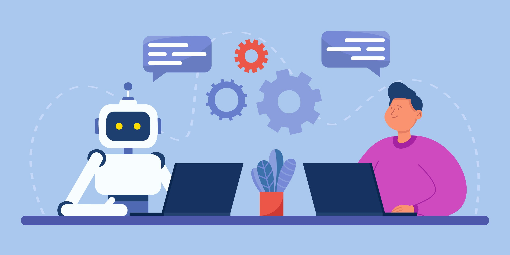

  

### I. Introduction

Artificial intelligence is a technological advancement that enables machines to perform cognitive functions, allowing computers and digital devices to learn, read, write, create, and analyze. It operates by combining vast amounts of data with intelligent algorithms, which then adapt through progressive learning algorithms to let the data do the programming. Consequently, AI facilitates new forms of interaction and can be particularly useful as a learning tool in the classroom. For example, it can help students grasp complex subjects and tailor learning experiences to their strengths and weaknesses. Additionally, AI is increasingly being utilized in higher education. A few popular applications include plagiarism detection, exam integrity, and academic research. What makes AI so powerful is its ability to process large quantities of data quickly and accurately, automate repetitive tasks, and learn from data to enhance its performance over time. ChatGPT is a free AI tool that can perform a variety of time-saving tasks. It is also conveniently available online, allowing me to access it and receive direct answers or, if necessary, detailed explanations. This is why I believe it is a fundamental learning tool that will improve software quality and enhance the overall efficiency of engineers.

### II. Personal Experience with AI:
I have used AI in class this semester in the following areas:

  1. Experience WODs e.g. E18
     
Experience WODs served as a learning material that allowed a student to practice and adapt the material covered in the week. For this, I did not use ChatGPT because of how the assignment was laid out, there were specific instructions and examples of how it will look when the experience is completed. Furthermore, there was a video that did the whole experience and acted as a good reference. Additionally, I sought help from peers to gain insight on how they were to go on about the question and learn that way.  

  2. In-class Practice WODs
Additionally, I did not use ChatGPT for in class practice WODs since I wanted to assess myself and get a basic understanding of how far I am able to get and other information for me to work on. It served as a reflection which allowed me to better understand myself, identifying my strengths and weaknesses. 

  3. In-class WODs
During The In class WODs, I have used ChatGPT but I always saved it for the end. During the WODs it was timed- essentially creating a sense of urgency and in result, creating mistakes I may not be able to see. If something was not properly working correctly I would turn to ChatGPT to help me understand what I was doing wrong and why my code was incorrect.   

  4. Essays
Gemini, which once was Bard, was the Ai tool that helped me a lot writing essays. In the past, I would write essays that led nowhere. With the help of Ai I gave them the idea of how I want to write my essay and I would receive feedback on what might be considered strong and appealing in an essay and the weaknesses. This helped me a lot as I find it difficult to fully explain my thoughts clearly.

  5. Final project
For my final project, I worked in a group developing UH RepCompanion, a gym buddy app which connects students to work out together. I had ChatGPT help me when it comes to ideas in styling. It would provide me answers to my “what if questions” which helped me tremendously when doing the work for the app.

  6. Learning a concept / tutorial
I frequently turned to ChatGPT for help with learning and understanding complex concepts and tutorials. For example, when I struggled with understanding asynchronous JavaScript, ChatGPT provided clear, step-by-step explanations and practical examples. This made it easier for me to grasp the concept and apply it correctly in my assignments, especially when I needed to implement asynchronous functions and handle callbacks.

  7. Answering a question in class or in Discord
I did not use ChatGPT to answer questions in class or on Discord because our class environment prioritized direct interactions with the instructor and peers. This setting allowed for immediate, contextually relevant responses and facilitated a more engaging learning experience. The instructor's real-time feedback and the collaborative discussions with classmates were more beneficial in these scenarios. 

  8. Asking or answering a smart-question
I refrained from using ChatGPT for asking or answering smart questions due to a previous assignment that emphasized the importance of crafting and responding to such questions independently. This assignment taught us how to formulate clear, concise questions and provide well-thought-out answers, which are crucial skills in the software engineering field. Practicing this independently helped me develop a better understanding of how to approach and solve problems effectively

  9. Coding example e.g. “give an example of using Underscore .pluck”
Yes, I often asked ChatGPT for coding examples. For instance, when I needed to understand how to use the Underscore.js .pluck function, ChatGPT provided practical examples that demonstrated its usage. This detailed guidance helped me comprehend how to extract specific properties from an array of objects and allowed me to implement the function correctly in my projects, saving time and ensuring accuracy.

  10. Explaining code
I’ve used ChatGPT to explain code snippets when I forgot specific details or needed a clearer understanding of certain parts. For example, if I encountered a complex piece of code involving closures in JavaScript, ChatGPT would break down the code, explaining how and why it worked. This assistance was invaluable in helping me solidify my understanding and improve my ability to explain the code to others. 

  11. Writing code
 ChatGPT was a great tool to assist with writing code, especially when tackling unfamiliar tasks. As I am not a professional coder, there were instances where I needed guidance on how to write certain functions or implement specific features. For example, when I had to write a recursive function, ChatGPT provided useful snippets and explanations, which boosted my confidence and efficiency in coding. 

  12. Documenting code
I did not use AI for documenting code because I preferred to handle documentation manually, keeping it organized within my project files. This approach ensured that my documentation was thorough and tailored to the specific needs of my projects, making it easier to reference later.

  13. Quality assurance 
I used ChatGPT for quality assurance tasks to ensure the accuracy of my code. Before making final commits on projects, I would use ChatGPT to identify and fix errors or ESLint issues. For example, if I encountered a cryptic error message or a series of linting issues, ChatGPT would help me understand and resolve these problems, ensuring my code was clean and functional.

  14. Other uses in ICS 314 not listed above
In addition to what I have mentioned, I used ChatGPT for organizational and advisory purposes. It helped me plan my project timelines, prioritize tasks, and provided advice on best practices in coding and project management. This guidance was crucial in maintaining efficiency and meeting deadlines.

### III. Impact on Learning and Understanding:

The incorporation of AI has become my go-to study buddy and tutor. It provides responses  quickly and thoroughly, tailored to my learning style and needs, which helps me comprehend assignments and ideas that I might not come up with on my own—offering a fresh perspective. With AI, I feel comfortable asking even the simplest questions, and I can dive deep into the basics of older topics I may have forgotten, which helps me solidify my understanding of complex concepts. For example, when I ask a question, AI not only breaks down the steps required but also explains them. It even provides me with code snippets; if I don't understand a line or need further clarification, I can highlight that code and ask for more detailed help. Consequently, asking AI my questions has refined my skill in formulating questions clearly to get the help I need. However, there comes a point where AI might lead me to a superficial understanding of topics, offering just a surface-level view that leaves me unsure of the importance of certain details.

### IV. Practical Applications:

The effectiveness of AI applications in addressing real-world software engineering challenges is significant. AI can be used alongside engineers to automate tedious tasks, assist in testing and debugging, and enhance knowledge acquisition. By handling mundane tasks, AI empowers engineers to focus on higher-level thinking and innovation, which are crucial for successful software development. Tools such as TensorFlow and AutoML are revolutionary for coders because they provide templates and snippets that adapt to the developer's style and project requirements. This significantly accelerates the development process and reduces the potential for human error. Additionally, AI can predict and generate test cases and conduct testing based on changes made to a codebase, further enhancing productivity and efficiency.

### V. Challenges and Opportunities:

While AI can achieve high levels of accuracy in certain tasks, sometimes even surpassing human performance, its accuracy can be compromised by several factors that may lead to errors. AI models heavily rely on the data they are trained on; thus, if the data is biased, incomplete, or poorly labeled, it may not accurately represent real-world scenarios and could inherit flaws. Additionally, many AI models can be static and may not adapt well to changes in context after they have been trained. This lack of adaptability can cause their performance to degrade and introduce limitations. In ICS 314, encountering inaccurate data can become problematic. For example, when I asked ChatGPT to explain a challenging concept, it provided misleading information, leading to confusion. Sometimes, AI may misinterpret a question and provide an extensive explanation of something unrelated. This illustrates why human intervention is still necessary to comprehend questions that AI models may not fully understand. Looking ahead, there are significant opportunities for further integration of AI in software engineering education. Enhancing AI's adaptability and accuracy, especially in dynamic learning environments, could profoundly improve how complex concepts are taught and understood. Additionally, developing more robust models that can interpret the nuances of student inquiries more effectively could enhance personalized learning experiences.

### VI. Comparative Analysis:

AI is a powerful tool that offers students personalized teaching, enhancing their learning experience with immediate feedback and support. However, it lacks the ability to provide mentorship and foster collaborative skills, which are crucial for software engineers. AI models do not possess consciousness, emotions, or personal experiences—elements that contribute to understanding and awareness in the human sense. They operate solely on the data they have been trained on, which can limit the learning experience.
Despite its usefulness at times, AI is not as engaging as human interaction, which can negatively impact knowledge retention. When it comes to applying knowledge in real-life work situations, students may find themselves lacking the practical skills that are vital for effective learning. Traditional teaching methods leverage emotional cues to gauge a student’s engagement and understanding, allowing educators to adapt their approach accordingly. They provide encouragement and feedback based on emotional and behavioral signs—capabilities that AI lacks.
Furthermore, collaboration is invaluable for developing communication and collaborative skills. AI cannot replicate the adaptive interactions provided by professors or instructors that help keep students engaged and aid in knowledge retention. Overall, while AI-enhanced approaches can supplement traditional teaching methods by offering tailored and immediate feedback, they cannot replace the comprehensive benefits of traditional educational interactions, especially in developing soft skills and practical applications in software engineering education.

### VII. Future Considerations:

By offering personalized learning routes and real-time feedback, artificial intelligence has the ability to further personalize software engineering education. This is especially advantageous for learners who are located remotely. Students from different backgrounds may find education more accessible as a result of this customisation.It's crucial to recognize, though, that AI may be biased due to the biases present in its training set, which could affect how the system learns. Furthermore, AI cannot take the role of fundamental skills taught by educators or the crucial human connections. Instead than taking the place of conventional teaching techniques, it should be carefully incorporated into them to improve student learning. In the future, integrating AI into education should concentrate on building a balanced strategy that keeps human components crucial for the development of soft skills like ethical reasoning and teamwork, while also utilizing AI to support the educational process. Future research should focus on creating AI tools that are flexible and conscious of their own prejudices in order to maintain their applicability and fairness. For teachers to successfully incorporate AI into their lessons, they will also require the right infrastructure and training.These issues can be resolved, and AI tools can be developed further to make software engineering education more accessible and adaptable.

### VIII. Conclusion:

AI should be properly incorporated with conventional teaching techniques to maximize its effectiveness in the classroom, boosting rather than substituting human contact. In order to identify and address biases and maintain the adaptability and relevance of AI systems, it is imperative that AI tools be continuously monitored and adjusted. It's critical to equip educators with the knowledge and resources they need to successfully incorporate AI. This includes instruction on the proper use of AI tools and their curriculum integration. The goal of future research should be to build self-aware AI systems that can identify and correct their biases while staying up to date with changing industry norms. Following these guidelines will enable AI to greatly enhance and complement software engineering classroom learning while preserving the vital human components of instruction.
