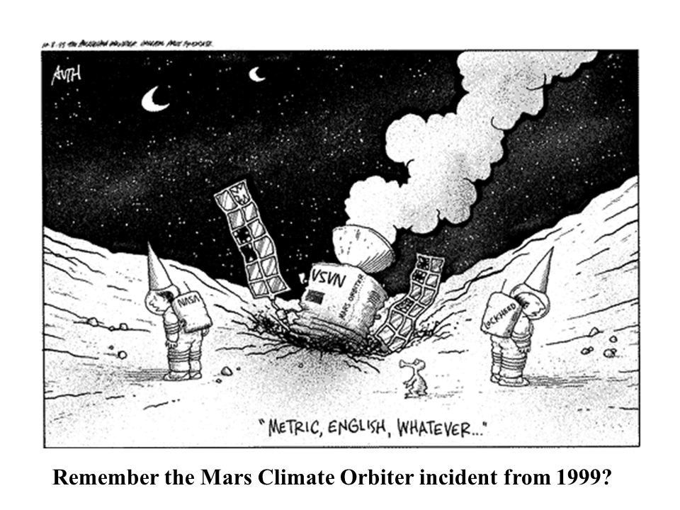

  

## The Jump

The tale of the Mars Climate Orbiter's failed mission due to a metric conversion oversight serves not just as a reminder of the complexities in software development but also echoes my initial jump into the concept of coding standards. 

## Unraveling Coding Standards

Coding standards are the blueprint for writing code. They dictate the aesthetic and structural aspects of coding, as grammar rules in writing. As the digital landscape evolved, so too have these guidelines. It is constantly evolving to meet the demands of new programming languages and technology. My journey began with an eagerness to understand how to maintain a codebase that any developer could navigate and collaborate on. The promise of clean, readable, secure, and efficient code was compelling, yet the reality of implementing these standards seemed daunting.

## Code Integrity

The clarity and consistency afforded by coding standards are not merely about aesthetics; they are the bedrock of a code's integrity. This concept resonated with me as I grappled with the intricacies of GitHub and IntelliJ IDEA, tools essential for upholding these unseen rules. I was overwhelmed; the steps to integrate and adhere to coding standards, such as disabling IntelliJ's JavaScript inspection and setting up ESLint, seemed like a mountain too great to overcome.

## Coding Standards in Action

My personal voyage with coding standards mirrored the broader narrative of software development. Each hurdle, from understanding GitHub to configuring IntelliJ IDEA, was a lesson in the value of these standards. The process, though intricate—downloading JS and JSON files, running npm install for ESLint, and integrating the underscore package—was a rite of passage. Watching tutorial videos in slow motion, I felt guided, yet the true understanding came from hands-on practice. The minutiae, those easy-to-forget steps, became the critical junctures where learning deepened.

## Navigating My Challenges

The path to adopting coding standards is fraught with challenges, much like my initial skepticism and struggle with the setup process. Yet, the essence of these standards is not to confine but to empower. As I progressed, the once overwhelming steps transformed into milestones, each bringing a sense of achievement similar to reaching a film's climax.

## The Horizon of Coding Standards

Looking ahead, the intersection of coding standards with emerging technologies presents a new frontier. My journey from confusion to competence underscores the adaptability required to navigate this evolving landscape. The potential for standards that evolve in real-time, adapting to the project's lifecycle, beckons a new era in software development.

The Mars Climate Orbiter's story, much like my initial encounter with coding standards, serves as a beacon, guiding us towards the imperative of embracing these guidelines. In software development, coding standards are the threads that ensure the strength and resilience of the end product. My journey, filled with challenges, has illuminated the undeniable value of these standards. They are not just rules but the foundation upon which collaborative, efficient, and innovative software is built. As I look to the future, the lessons learned from mastering coding standards will undoubtedly serve as an invaluable tool in my arsenal, ensuring that the code I write not only meets but exceeds the demands of tomorrow's digital landscape.
