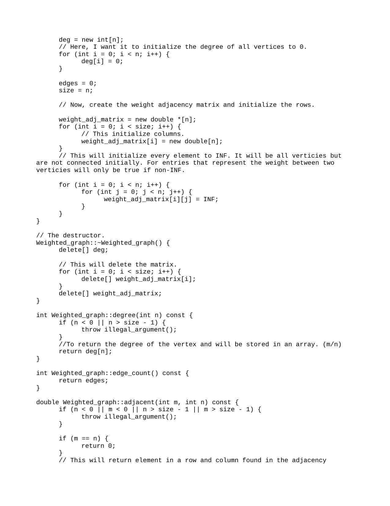
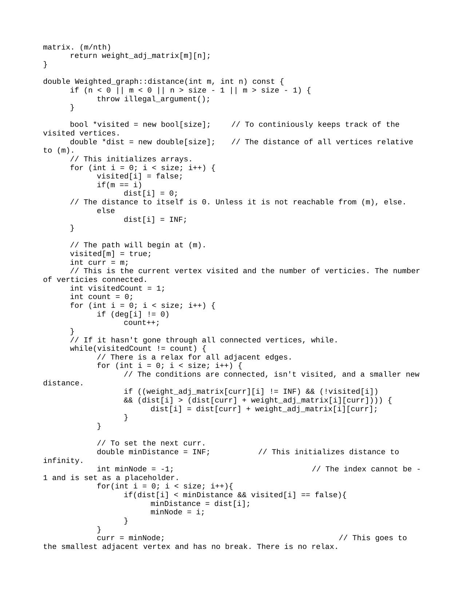
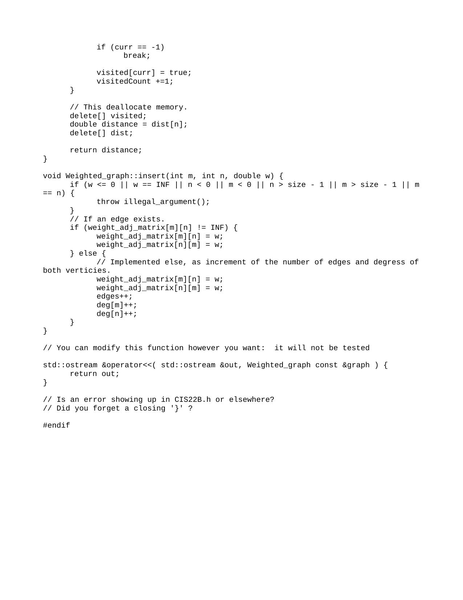

## Project Overview: Dijkstra's Algorithm Implementation

## Introduction:
In this project, you will delve into the world of graph theory by implementing Dijkstra's algorithm. The primary goal is to create a class, `Weighted_graph`, which allows users to construct, manipulate, and explore undirected weighted graphs. This class facilitates the calculation of the shortest distance between connected vertices, contributing to a fundamental understanding of graph-based algorithms.

# Project Specifications:
1. Class: Weighted_graph
   - Constructors:
     - `Weighted_graph(int n = 50)`: Construct an undirected graph with n vertices (default is 50). If n ≤ 0, use n = 1.
   - Destructor:
     - `~Weighted_graph()`: Clean up any allocated memory.
   - Accessors:
     - `int degree(int n) const`: Returns the degree of the vertex n. Throws an illegal argument exception if the argument does not correspond to an existing vertex. (O(1))
     - `int edge_count() const`: Returns the number of edges in the graph. (O(1))
     - `double adjacent(int m, int n) const`: Returns the weight of the edge connecting vertices m and n. If the vertices are the same, return 0. If the vertices are not adjacent, return infinity. Throws an illegal argument exception if the arguments do not correspond to existing vertices.
   - Mutators:
     - `void insert(int m, int n, double w)`: If the weight w ≤ 0 or is infinity, throws an illegal argument exception. If w > 0, adds an edge between vertices m and n. If an edge already exists, replaces the weight of the edge with the new weight. Throws an illegal argument exception if the vertices do not exist or are equal.
     - `double distance(int m, int n)`: Returns the shortest distance between vertices m and n. Throws an illegal argument exception if the arguments do not correspond to existing vertices. The distance between a vertex and itself is 0.0. The distance between vertices that are not connected is infinity.

# Purpose 
The purpose of this project is to reinforce my understanding of the material and initiate the development of your personal library of tools. Subsequent projects may build upon the concepts and implementations from this project, emphasizing the interconnected nature of various data structures.

