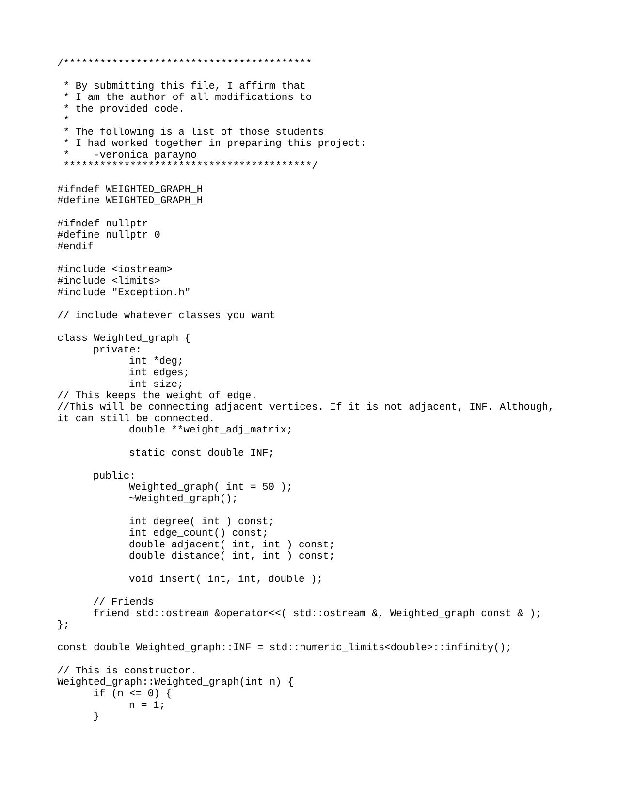
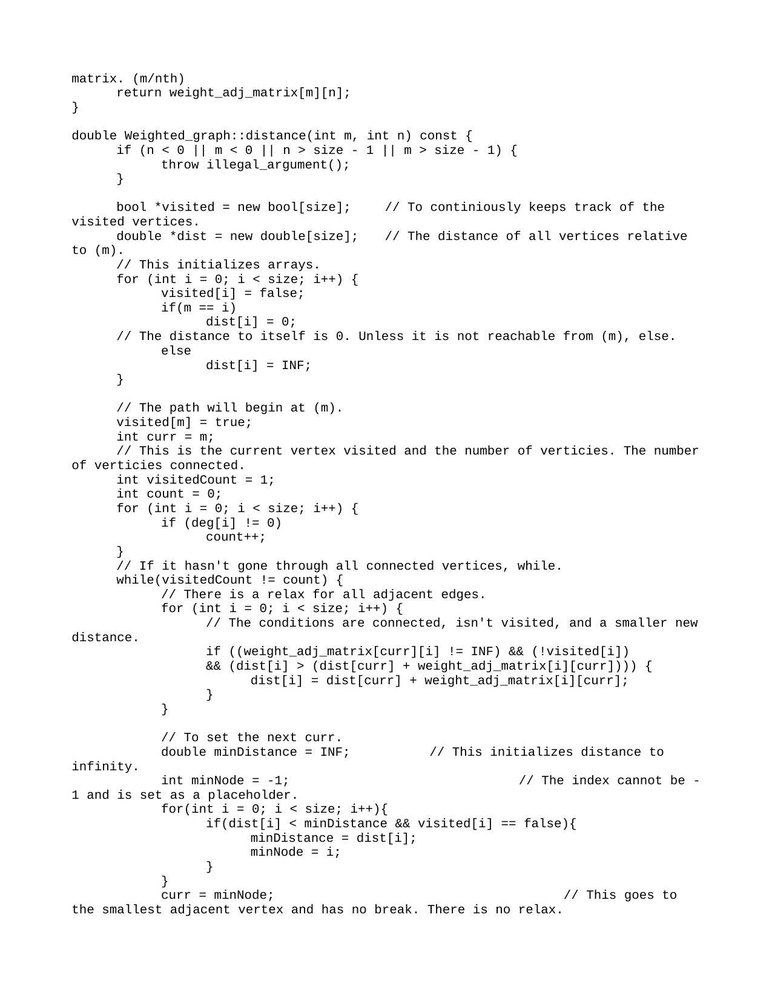
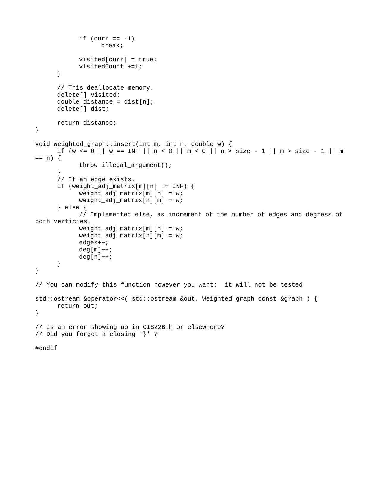

The C++ code presented encapsulates the implementation of Dijkstra's algorithm within the `Weighted_graph` class, designed to handle undirected weighted graphs. The class features essential functionalities for creating, managing, and destructing weighted graphs. In the constructor, it initializes the degree of vertices and constructs a weight adjacency matrix, ensuring seamless graph representation. The destructor efficiently handles memory cleanup. The `insert` function incorporates edge addition, dynamically updating the weight adjacency matrix while considering edge existence to prevent duplicates. The `distance` function effectively computes the shortest path between two vertices, employing Dijkstra's algorithm by maintaining arrays for visited vertices and distance calculations.

This implementation aligns with the assignment's specifications, adhering to the required class structure and methods outlined in the project description. It ensures proper error handling by throwing exceptions when necessary, offering a robust solution for weighted graph manipulation. The code embraces good programming practices, featuring meaningful variable names, clear indentation, and insightful comments, enhancing its readability and facilitating understanding. Overall, the provided C++ code aptly fulfills the project's purpose, providing a robust and functional implementation of Dijkstra's algorithm within the context of weighted graphs.

