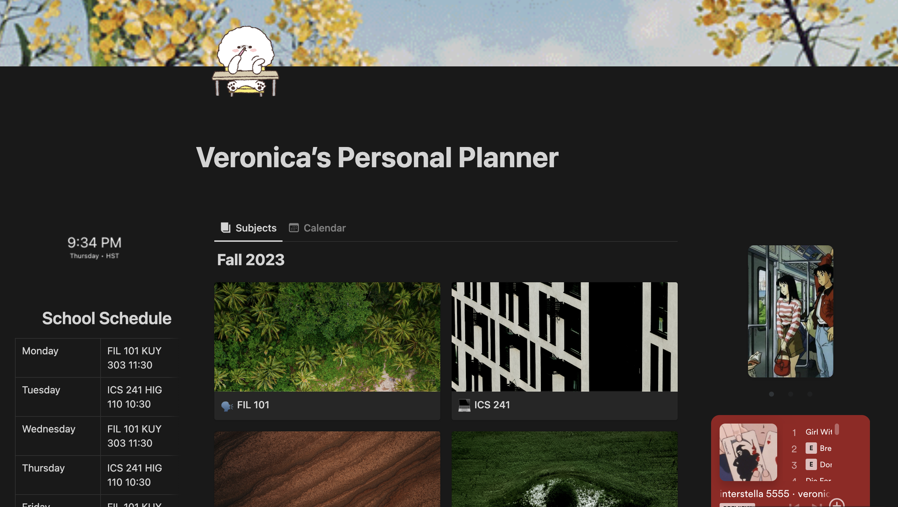

In crafting my Notion planner, I had a journey to design a versatile and personalized digital organizational tool. Rooted in this project is efficiency and innovation, this Notion project embodies a dynamic synergy of user-centric features. The planner allows for seamless navigation through various facets of personal and professional life, utilizing interactive elements and dynamic content blocks. I created an intuitive interface, leveraging Notion's capabilities to integrate task management, goal tracking, and note-taking into a unified and visually engaging experience. The planner seamlessly adapts to the needs of its users, fostering a sense of empowerment in digital organization.

In this endeavor, creativity works hand in hand with functionality as the Notion planner transcends conventional organizational tools. The project seamlessly blends aesthetic appeal with practical utility, offering an immersive and enjoyable planning experience. The personalized touch extends to color-coded categorizations, interactive widgets, and integrative modules that transform mundane planning into an engaging journey. The Notion planner, born from a fusion of creativity and technological prowess, stands as a testament to the limitless possibilities of digital organization, providing users with an innovative and enjoyable means to navigate the complexities of their daily lives.

 

 
